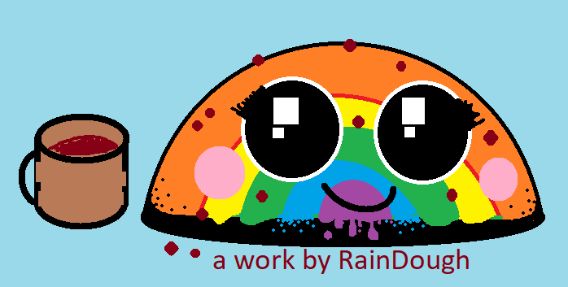

# raindough

Educational browser based games for young children (age 1 to 10)

 - [Toddler Keyboard](https://countable.github.io/toddler-keyboard/) - Ages 1-3. Mashing keys shows corresponding animals.
 - [Cats of Jasnah](https://countable.github.io/cats-of-jasnah/) - Ages 3-8. Teaches counting and logic.
 - [Equation dragon](https://countable.github.io/equation-dragon/) - Ages 5-10. Teaches equations.

Unfinished work:
 - [Jasnah's Maze](https://countable.github.io/jasnahs-maze/) - Ages 4+. *A work in progress* maze game.

   
